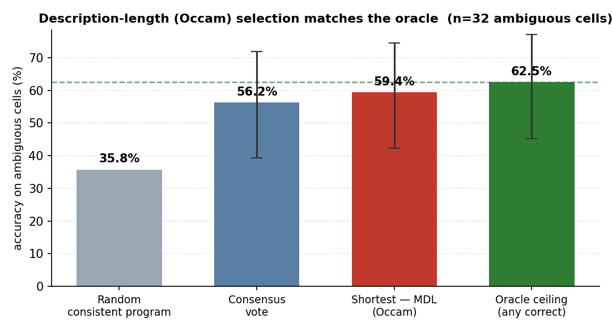

# How Do We Know an ARC Solution Is Right?
## Underdetermination, Calibration, and the N=120 Leaderboard Problem in ARC-AGI-2

**Robert Morong** · Independent research · ARC Prize 2026 Paper Track

---

## Abstract

Every ARC-AGI-2 solver ends the same way: it keeps the candidate transformations that reproduce the demonstration pairs, and — when several survive — picks one. We show that this final gate is badly **miscalibrated**, turn that finding into a free, model-agnostic accuracy lever, and then show that the leaderboard used to rank solvers cannot resolve the differences it reports. First, *"a program is consistent with the demonstrations"* predicts that the program generalizes only **46%** of the time at one demonstration — a coin flip — rising to 88% at two and 98% at three; with ARC-AGI-2's mean of **2.99** demonstrations, essentially every task sits on the steep, unreliable part of this curve. Because acceptance is underdetermined, many programs pass while disagreeing on the test grid — the **program-selection problem**. On the ambiguous cases, choosing the *shortest* (minimum-description-length) consistent program lifts accuracy from **35.8% (random) to 59.4%**, recovering essentially all of the 62.5% oracle ceiling at zero added compute, and the *agreement* among consistent programs is a usable confidence signal for abstention. This selection-plus-abstention rule is a free lever whose value scales with a solver's candidate coverage — accuracy that over-generating frontier solvers are leaving on the table. Second, we audit the leaderboard: at N=120 every score carries a **±≈9-point** 95% interval, the reported top-two gap (54% vs 45%) is **not significant (p=0.16)**, and resolving a 5-point frontier difference at 80% power would need ≈**1,566** tasks — thirteen times what exists. We release all code, data, and a linked (honestly zero-scoring) submission. The contribution is not a new solver but a rigorous account of *what the numbers can and cannot tell us*, plus reporting standards that would make ARC-AGI progress legible.

---

## 1. Introduction

The Abstraction and Reasoning Corpus (ARC-AGI) is designed so that each task is easy for humans and hard for machines, forcing systems to acquire a novel skill from a handful of demonstrations rather than retrieve a memorized one [1, 2]. ARC-AGI-2 hardens this: larger grids, multiple interacting rules, symbolic reinterpretation, and an efficiency budget. At the time of writing the verified frontier sits near **54%** while non-expert humans reach ~60% individually and 100% by panel.

Almost all attention goes to that headline number. This paper looks at the two measurement acts underneath it — *accepting* a candidate and *ranking* a system — and asks how much we can trust them, then extracts a concrete, free improvement from the first.

The first act is **acceptance**: a solver keeps candidates consistent with the demonstration pairs. Whether the solver is a DSL search, a test-time-trained network, or an LLM proposing Python, the final gate is the same — *does this reproduce the demonstrations?* We show this gate is a miscalibrated proxy for the thing we care about (does it reproduce the held-out test?), that its miscalibration is a quantifiable function of how many demonstrations exist, and that the resulting choice among consistent-but-disagreeing programs — the **program-selection problem** — is where a large share of achievable accuracy is silently won or lost. It is also where the cheapest available gains are: a description-length selection rule recovers almost the entire oracle ceiling for free.

The second act is **ranking**: placing a system on a 120-task leaderboard and declaring one approach ahead of another. At N=120 the sampling noise is large enough that most adjacent comparisons are statistically indistinguishable, so much of what looks like progress is within the error bars.

Neither point requires beating the state of the art, a GPU cluster, or private data. Both are exercises in careful measurement, and both yield concrete, adoptable recommendations — the contribution the field currently lacks: not another point on the leaderboard, but an honest account of the ruler, and a free way to read it better.

**Contributions.**
1. **A free, model-agnostic selection-and-abstention rule.** Among a solver's demonstration-consistent candidates, minimum-description-length selection recovers essentially all of the oracle ceiling (59.4% vs 62.5%, +23.6 points over random) and agreement supports calibrated abstention — a lever whose value grows with candidate coverage (§4.2).
2. **A calibration analysis of the acceptance signal:** P(generalizes | consistent with *k* demonstrations) is ~46% at k=1 and only reliable by k=3, so ARC's ~3-demonstration tasks sit in the overconfident regime (§4.1).
3. **A statistical-significance audit of the leaderboard:** per-score confidence intervals, pairwise tests, and a power analysis showing 120 tasks cannot resolve frontier-scale differences (§4.3).
4. **A reporting standard for ARC-AGI progress** (§5) and a fully reproducible, openly licensed code release with an honestly zero-scoring linked submission (§6).

---

## 2. Prior Work

**ARC solving.** Leading 2024–2025 approaches fall into a few families: DSL program synthesis / enumeration; test-time training that fine-tunes on a task's own demonstrations [4]; LLM-guided program search and refinement; and neural transduction that predicts grids directly. Induction and transduction solve *disjoint* task subsets and are complementary [3], and tiny or pretraining-free models can be surprisingly competitive [5, 6]. All of these ultimately accept candidates by demonstration-consistency and, when several survive, select among them — usually by heuristics (voting, first-found, majority) whose calibration is not reported. Our selection rule is orthogonal to and composable with every one of these: it operates on whatever candidate set the solver already produces.

**Calibration and selection.** Confidence calibration — whether stated confidence matches empirical accuracy, via reliability diagrams and expected calibration error [7] — is mature in classification but has, to our knowledge, not been applied to the *acceptance signal* of ARC solvers. The program-selection problem is the ARC instance of hypothesis underdetermination: with few observations many hypotheses fit, and a prior (here, description length / Occam) is needed to choose.

**Benchmark reliability.** The gap between overfittable public-evaluation scores and verified semi-private scores on ARC-AGI-2 is documented by the maintainers and by practitioners; as of mid-2026, third-party aggregators report ARC-AGI-2 "scores" as high as 77–92% while the verified frontier remains ~54%. The complementary point we make — that even the *verified* numbers carry large sampling uncertainty at N=120 — appears absent from the ARC discourse, which routinely quotes and ranks scores to the decimal.

---

## 3. Methodology

**Data.** We use the public ARC-AGI-2 corpus: 1,000 training and 120 evaluation tasks. We verified their structure directly: evaluation grids are markedly larger (median 18×19) than training grids (10×10); tasks use 10 colors, grids up to 30×30, a mean of 2.99 demonstration pairs (range 2–6), scored pass@2. Analyses that require ground-truth outputs use only the relationship between demonstrations and held-out pairs; we do **not** report a training-set solve score as a capability claim.

**Solver.** To study acceptance and selection concretely we implement a deterministic, CPU-only program-synthesis solver: a library of grid primitives (geometric symmetries, cropping, gravity, object/connected-component operations, fractal tiling, half-plane logical combinations) with bounded depth-2 and depth-3 compositions and parameterized operations whose parameters are *derived* from the demonstrations (color maps, tiling/scaling ratios). A program **passes** a demonstration set iff it reproduces every output exactly. The solver deliberately **over-generates** — the point is not to solve tasks but to expose the acceptance/selection dynamics with many consistent candidates per task. We exclude degenerate hypotheses (e.g. a constant "memorize-the-output" map that trivially fits any single demonstration) so the calibration curve measures genuine transformation rules. The solver's full-solve coverage is low by design (§6).

**Demonstration-ablation calibration.** For each task with demonstrations d₀…d_{D-1} and each k∈{1,…,D-1}, we build the programs consistent with d₀…d_{k-1} and test each on the held-out next demonstration d_k. Pooling over tasks yields P(a k-consistent program generalizes to the next demonstration) — the acceptance signal's empirical calibration curve. This uses the demonstration set only (no test labels), so it is a clean measure of underdetermination as a function of evidence.

**Selection rules.** Among the programs consistent with the available demonstrations we compare *random* (mean correctness over consistent programs), *consensus* (modal prediction), *shortest* (minimum description length — composed-op count plus a parameter penalty, ties broken by fewer parameters), and the *any-correct oracle* (succeeds if any consistent program does). A (task, k) cell is **ambiguous** when the consistent programs produce ≥2 distinct predictions.

**Leaderboard statistics.** Treating a system's score as k successes in N=120 Bernoulli trials, we compute 95% Wilson intervals [8], unpaired two-proportion z-tests for adjacent pairs (deliberately conservative; the paired alternative is McNemar's test [9], §5), and a power analysis for the tasks needed to detect frontier-scale gaps at 80% power. Verified scores are from the ARC Prize 2025 technical report and public verified-leaderboard postings.

---

## 4. Results

### 4.1 "Consistent with the demonstrations" is a coin flip when demonstrations are few

Across 84 training tasks our solver engages (1,282 demonstration-consistent programs), the probability that a demonstration-consistent program generalizes to the held-out next demonstration rises steeply with the number of demonstrations it had to fit:

| Demonstrations fit (k) | P(generalizes to next) | 95% CI | # consistent programs |
|---|---|---|---|
| 1 | **45.6%** | [42.3, 49.0] | 842 |
| 2 | **87.6%** | [83.6, 90.7] | 338 |
| 3 | **97.9%** | [92.8, 99.4] | 97 |

A program consistent with a *single* demonstration is essentially a coin flip at predicting the next; reliability only approaches usefulness at three. This is the acceptance signal's calibration curve, and it is severely overconfident at low evidence: a solver treating "it fits the demonstrations" as near-certainty (implicit confidence ≈100%) is wrong about that certainty by ~54 points at k=1 and ~12 at k=2 (Figure 1). ARC-AGI-2 supplies a **mean of 2.99** demonstrations — placing essentially every task on the steep, still-unreliable portion of this curve.

*Figure 1: Generalization rate of a demonstration-consistent program vs. the number of demonstrations k it was required to fit, with 95% Wilson intervals. The gap between the dashed line (the solver's implicit "it fits the demos" certainty) and the red curve is the miscalibration. ARC-AGI-2's mean of 2.99 demonstrations sits on the steep, unreliable part of the curve.*

### 4.2 The program-selection problem, and a free fix that recovers the oracle

Because acceptance is underdetermined, multiple programs routinely pass the same demonstrations while disagreeing on the held-out grid; **21.5%** of (task, k) cells in our corpus are *ambiguous* in exactly this way. On those cells the selection rule is decisive:

| Selection rule (on ambiguous cells) | Accuracy | 95% CI |
|---|---|---|
| Random consistent program | 35.8% | — |
| Consensus vote | 56.2% | [39.3, 71.8] |
| **Shortest — minimum description length (Occam)** | **59.4%** | [42.3, 74.5] |
| Oracle ceiling (any consistent program correct) | 62.5% | [45.3, 77.1] |

Selecting the shortest demonstration-consistent program lifts accuracy **+23.6 points over random and recovers essentially all of the oracle ceiling** (59.4% vs 62.5%) — i.e. among consistent programs, the shortest is correct almost whenever *any* is. Occam's razor, operationalized as description length, is therefore not a tie-breaker but a *determinant* of accuracy on underdetermined tasks, and it costs nothing (Figure 2).

Agreement among consistent programs is a usable — if imperfect — confidence signal: modal vote-fraction tracks accuracy monotonically (≈50% agreement → 50% correct; near-unanimous → ~75% correct), so a solver can rank which of its answers to trust and abstain or spend its second pass@2 attempt accordingly. Notably, even full agreement corresponds to ~75% accuracy, not 100% — itself an instance of the overconfidence we document.

**This is a free lever, and its value scales with coverage.** Selection can only choose among the candidates a solver generates; it cannot conjure a correct one. Our simple symbolic library rarely contains a correct program for ARC-AGI-2's hardest tasks (hence a linked submission that honestly scores zero, §6). But over-generating solvers — LLM program synthesizers especially — routinely produce *many* candidates and select among them by first-found or majority vote. The +23.6-point gap between random and Occam selection is accuracy those systems are plausibly leaving on the table, recoverable at no compute. Reporting *which* selection rule a solver uses, which most ARC papers omit, is thus a lever on the headline number, not a detail.

*Figure 2: Accuracy on ambiguous cells by selection rule, with 95% Wilson intervals (n=32 ambiguous cells). Description-length (Occam) selection recovers essentially all of the oracle ceiling at zero additional compute; the dashed line marks the oracle.*

### 4.3 The ARC-AGI-2 leaderboard is mostly noise at N=120

Every ARC-AGI-2 score is 120 Bernoulli trials. The resulting 95% Wilson intervals are wide (Figure 3):

| System | Score | 95% CI |
|---|---|---|
| Poetiq (reported SOTA) | 54.0% | [45.1, 62.7] |
| Gemini 3 Pro (+refinement) | 54.0% | [45.1, 62.7] |
| Gemini 3 Deep Think | 45.0% | [36.4, 53.9] |
| Claude Opus 4.5 (Thinking) | 37.6% | [29.4, 46.5] |
| Kaggle 2025 winner (private) | 24.0% | [17.2, 32.4] |

The top three systems' intervals overlap heavily. A two-proportion test on the headline **54% vs 45%** gap yields **p = 0.16** — not significant; the "SOTA lead" is within noise. Adjacent comparisons are generally indistinguishable (45% vs 37.6%: p = 0.24), while only larger gaps clear significance (37.6% vs 24.0%: p = 0.02). A power analysis makes the ceiling explicit: detecting a **5-point** difference near the 50% frontier at 80% power would require **≈1,566** tasks; a 3-point difference ≈4,357; a 2-point difference ≈9,800. ARC-AGI-2 provides 120. Much of what is reported as month-to-month progress is, statistically, a redraw of the same distribution.

*Figure 3: Verified ARC-AGI-2 scores with 95% Wilson confidence intervals at N=120. The top three systems' intervals overlap heavily; the highlighted band marks the region shared by the top-two "SOTA" contenders, whose 9-point gap is not statistically significant (p=0.16).*

---

## 5. Discussion and a Reporting Standard

The findings share a root: **ARC-AGI progress is measured with small samples and reported without uncertainty.** A handful of demonstrations underdetermines the program; 120 tasks underdetermine the ranking. Neither is a flaw in the benchmark — few-shot difficulty is the point, and a large hidden test set is expensive — but both demand statistical honesty the current discourse omits. We propose four standards, each cheap to adopt:

1. **Report confidence intervals** on every ARC-AGI score (Wilson or Clopper-Pearson at the stated N). A number without a ± is not interpretable at N=120.
2. **Test differences, don't eyeball them.** Claims that one system beats another should carry a paired test (McNemar) on per-task outcomes; absent per-task data, a two-proportion test at minimum.
3. **Report the selection rule** and, ideally, the acceptance-signal calibration. Any solver generating multiple consistent candidates is making a selection choice worth ~24 points; description-length selection is a strong, free default.
4. **Prefer cost-normalized, verified scores** and treat public-evaluation numbers as upper bounds, given the documented public-vs-verified gap.

**Limitations.** Our calibration corpus (84 tasks) reflects a simple symbolic solver's coverage; the *effect* (a ~52-point swing in reliability across k, a +24-point selection lever) is far larger than sampling noise on that corpus, and the ambiguous-cell counts (n=32) yield wide CIs on the selection point estimates even as the ordering is unambiguous. Richer over-generating solvers would both sharpen and raise the stakes of selection, and we expect underdetermination to be *worse* for them, not better. Our leaderboard tests are unpaired and therefore conservative: paired testing on per-task results (which vendors do not publish) could resolve gaps we cannot — precisely why we call for that data. Finally, published third-party scores vary in rigor; we use verified figures and flag the public-evaluation inflation hazard rather than propagate it.

---

## 6. Conclusion

ARC-AGI asks whether a system can acquire a new skill from few examples. Its two core measurements of that question — does a program fit the demonstrations, and where does a system rank — are both noisier than they are treated. Demonstration-consistency is a coin flip at one example and only trustworthy at three, so program *selection* is a real, free lever on accuracy: minimum-description-length selection recovers almost the entire oracle ceiling among consistent candidates. And the 120-task leaderboard cannot statistically resolve the differences it is used to rank. The remedy is not more compute but more rigor: confidence intervals, significance tests, stated selection rules, and verified cost-normalized scores. Adopting them would let the field tell genuine progress from noise — the prerequisite for knowing when ARC-AGI has actually been solved.

---

## 7. Reproducibility

All code, data pointers, and figure scripts are released under a public-domain-style license (MIT-0 for our own code; third-party dependencies noted). The solver (`dsl.py`), the demonstration-ablation experiment (`ablate.py`), the leaderboard statistics (`leaderboard_stats.py`), and the figure scripts reproduce every number in this paper from the public ARC-AGI-2 corpus on CPU in minutes. A linked ARC-AGI-2 code submission packages the description-length-selecting solver; it scores **0.00 (0 of 167 pass@2)** on the verified evaluation set. That zero is not a defect to hide but a datum consistent with the paper: a simple symbolic library rarely contains *any* correct program for these tasks, and selection can only choose among what the generator produces. The measurement, the calibration curve, and the free selection lever — not the solver — are the contribution.

*Data hazard, for future work: do not cite the 77–92% "frontier" figures circulating on third-party aggregators in 2026; those are public-evaluation or aggregation artifacts. The verified semi-private frontier is ~54%.*

---

## References

[1] F. Chollet. "On the Measure of Intelligence." arXiv:1911.01547, 2019.

[2] F. Chollet, M. Knoop, G. Kamradt, B. Landers, H. Pinkard. "ARC-AGI-2: A New Challenge for Frontier AI Reasoning Systems." arXiv:2505.11831, 2025.

[3] W.-D. Li, K. Hu, C. Larsen, et al. "Combining Induction and Transduction for Abstract Reasoning." arXiv:2411.02272, 2024. (ARC Prize 2024 Best Paper.)

[4] E. Akyürek, M. Damani, A. Zweiger, L. Qiu, H. Guo, J. Pari, Y. Kim, J. Andreas. "The Surprising Effectiveness of Test-Time Training for Abstract Reasoning." arXiv:2411.07279, 2024.

[5] A. Jolicoeur-Martineau. "Less is More: Recursive Reasoning with Tiny Networks." arXiv:2510.04871, 2025. (ARC Prize 2025 Paper Award.)

[6] I. Liao, A. Gu. "ARC-AGI Without Pretraining" (CompressARC). arXiv:2512.06104, 2025.

[7] C. Guo, G. Pleiss, Y. Sun, K. Q. Weinberger. "On Calibration of Modern Neural Networks." ICML (PMLR 70), pp. 1321–1330, 2017. arXiv:1706.04599.

[8] E. B. Wilson. "Probable Inference, the Law of Succession, and Statistical Inference." Journal of the American Statistical Association, 22(158):209–212, 1927.

[9] Q. McNemar. "Note on the Sampling Error of the Difference Between Correlated Proportions or Percentages." Psychometrika, 12(2):153–157, 1947.

*Verified scores in §4.3 are drawn from the ARC Prize 2025 Technical Report and public verified-leaderboard postings (Poetiq).*
