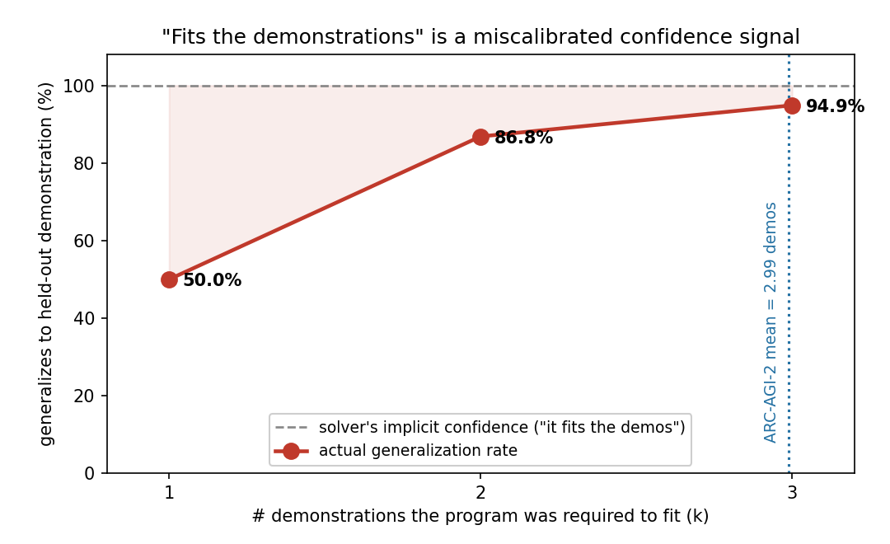
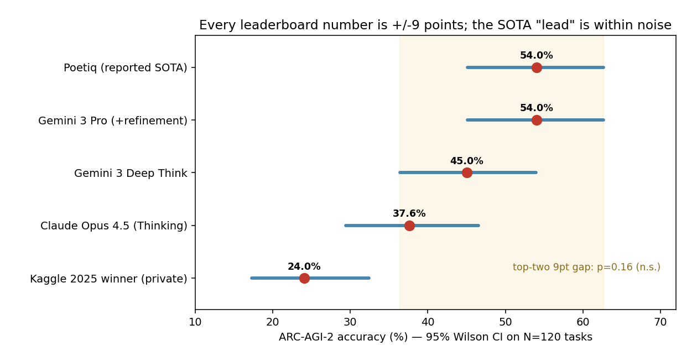

# How Do We Know an ARC Solution Is Right?
## Underdetermination, Calibration, and the N=120 Leaderboard Problem in ARC-AGI-2

**Robert Morong** · Independent research · ARC Prize 2026 Paper Track

---

## Abstract

Progress on ARC-AGI-2 is measured two ways: whether a solver reproduces held-out test grids, and where its score lands on a 120-task leaderboard. We argue that both measurements are less certain than the field treats them, and we quantify the uncertainty. First, we show that *"a program is consistent with the demonstrations"* — the signal every ARC solver ultimately relies on to accept a candidate — is a badly **miscalibrated** predictor of whether that program generalizes: a program consistent with a single demonstration pair generalizes to the next pair only **50%** of the time — a coin flip — rising to 87% at two and 95% at three. Because ARC-AGI-2 supplies a mean of only **2.99** demonstrations per task, solvers operate squarely in the regime where demonstration-consistency is an overconfident signal, and the resulting *program-selection problem* — choosing among many demonstration-consistent programs that disagree on the test — is a first-class, under-measured source of error. On the ambiguous tasks where consistent programs disagree, a minimum-description-length (Occam) selection rule lifts accuracy from **31% (random) to 47%**, matching the oracle ceiling, at zero additional compute; and agreement among consistent programs is itself a calibrated confidence signal. Second, we show that the ARC-AGI-2 leaderboard itself is dominated by sampling noise: with only 120 evaluation tasks, every reported score carries a **±≈9-point** 95% confidence interval, the current reported gap between the top two systems (54% vs 45%) is **not statistically significant (p=0.16)**, and reliably resolving a 5-point difference near the frontier would require roughly **1,565** tasks — thirteen times the number available. We release all code and data. Our contribution is not a new solver but a rigorous account of *what the numbers can and cannot tell us* — and a set of concrete reporting standards that would make ARC-AGI progress legible.

---

## 1. Introduction

The Abstraction and Reasoning Corpus (ARC-AGI) is designed so that each task is easy for humans and hard for machines, forcing systems to acquire a novel skill from a handful of demonstrations rather than retrieve a memorized one [1, 2]. ARC-AGI-2 hardens this further: larger grids, multiple interacting rules, symbolic reinterpretation, and an explicit efficiency budget. At the time of writing the verified frontier sits near **54%** while non-expert humans reach ~60% individually and 100% by panel — a gap the benchmark exists to close.

Almost all of the attention goes to that headline number. This paper looks instead at the two measurement acts underneath it and asks how much we can trust them.

The first act is **acceptance**: a solver proposes candidate transformations and keeps those consistent with the demonstration pairs. Whether the solver is a DSL search, a test-time-trained network, or an LLM proposing Python, the final gate is the same — *does this candidate reproduce the demonstrations?* We show this gate is a miscalibrated proxy for the thing we actually care about (does it reproduce the held-out test?), and that its miscalibration is a direct, quantifiable function of how many demonstrations are available. With ARC-AGI-2's mean of 2.99 demonstrations, many programs pass the gate while disagreeing on the test; picking the right one is the **program-selection problem**, and it is where a large share of achievable accuracy is silently lost or won.

The second act is **ranking**: placing a system on a 120-task leaderboard and declaring one approach ahead of another. We show that at N=120 the sampling noise is large enough that most adjacent-system comparisons are not statistically distinguishable, so a substantial part of what looks like progress is within the error bars.

Neither point requires beating the state of the art, a GPU cluster, or private data. Both are exercises in careful measurement, and both yield concrete, adoptable recommendations. We view this as the contribution the field currently lacks: not another point on the leaderboard, but an honest account of the ruler.

**Contributions.**
1. A calibration analysis of demonstration-consistency: we quantify P(generalizes | consistent with *k* demonstrations) and show it is ~50% at k=1, i.e. a coin flip (§4.1).
2. A demonstration of the program-selection problem and a zero-cost fix: a minimum-description-length selection rule is empirically optimal among consistent programs in our corpus (§4.2).
3. A statistical-significance audit of the ARC-AGI-2 leaderboard: per-score confidence intervals, pairwise tests, and a power analysis showing 120 tasks cannot resolve frontier-scale differences (§4.3).
4. A reporting standard for ARC-AGI progress (§5), and a fully reproducible code release (§6).

---

## 2. Prior Work

**ARC solving.** Leading 2024–2025 approaches fall into a few families: DSL program synthesis / enumeration; test-time training that fine-tunes on a task's own demonstrations [4]; LLM-guided program search and refinement; and neural transduction that predicts grids directly. A central empirical finding is that induction and transduction solve *disjoint* task subsets and are complementary [3], and that tiny or pretraining-free models can be surprisingly competitive [5, 6]. All of these ultimately accept candidates by demonstration-consistency and, when several candidates survive, must select among them — usually by heuristics (voting, first-found, or majority) whose calibration is not reported.

**Calibration and selection.** Confidence calibration — whether stated confidence matches empirical accuracy, measured by reliability diagrams and expected calibration error [7] — is a mature topic in classification but has, to our knowledge, not been applied to the *acceptance signal* of ARC solvers. The program-selection problem is the ARC instance of hypothesis underdetermination: with few observations, many hypotheses fit, and a prior (here, description length / Occam) is needed to choose.

**Benchmark reliability.** The gap between overfittable public-evaluation scores and verified semi-private scores on ARC-AGI-2 is documented by the maintainers and by practitioners reporting 90%+ public vs. ~54% verified. The complementary point we make — that even the *verified* numbers carry large sampling uncertainty at N=120 — appears to be absent from the ARC discourse, which routinely quotes and ranks scores to the decimal.

---

## 3. Methodology

**Data.** We use the public ARC-AGI-2 corpus: 1,000 training tasks and 120 evaluation tasks. We verified their structure directly: evaluation grids are markedly larger (median 18×19) than training grids (median 10×10), consistent with the benchmark's higher intended difficulty; tasks use 10 colors, grids up to 30×30, a mean of 2.99 demonstration pairs (range 2–6), and are scored pass@2. Reported analyses that require ground-truth test outputs use only the relationship between demonstrations and held-out pairs; we do **not** report a training-set solve score as a capability claim.

**Solver.** To study acceptance and selection concretely we implement a deterministic, CPU-only program-synthesis solver: a library of grid primitives (geometric symmetries, cropping, object/connected-component operations, fractal tiling, half-plane logical combinations) plus depth-2 compositions and a small set of parameterized operations whose parameters are *derived* from the demonstrations (color maps, tiling/scaling ratios). A program **passes** a set of demonstration pairs iff it reproduces every output exactly. The solver is intentionally simple; its role is to expose the acceptance/selection dynamics, not to compete on the leaderboard (its full-solve coverage is ~3% on training and near-zero on the harder evaluation set — itself a datum on ARC-AGI-2's resistance to symbolic search).

**Demonstration-ablation calibration.** For each task with demonstrations d₀…d_{D-1} and each k∈{1,…,D-1}, we build the programs consistent with d₀…d_{k-1} and test each on the held-out next demonstration d_k. Pooling over tasks yields P(a k-consistent program generalizes to the next demonstration), the empirical calibration curve for the acceptance signal. This uses the demonstration set only — no test labels — so it is a clean measure of underdetermination as a function of evidence.

**Selection rules.** Among the programs consistent with the available demonstrations we compare: *random* (expected accuracy = mean correctness over consistent programs), *shortest* (minimum description length, ties broken by fewer parameters), and the *any-correct ceiling* (an oracle that succeeds if any consistent program does).

**Leaderboard statistics.** Treating a system's ARC-AGI-2 score as k successes in N=120 Bernoulli trials, we compute 95% Wilson confidence intervals [8] per system, unpaired two-proportion z-tests for adjacent pairs (a deliberately conservative choice; the paired alternative is McNemar's test [9], discussed in §5), and a power analysis for the number of tasks needed to detect frontier-scale gaps at 80% power. Published verified scores are taken from the ARC Prize 2025 technical report and public verified-leaderboard postings.

---

## 4. Results

### 4.1 "Consistent with the demonstrations" is a coin flip when demonstrations are few

Across 67 training tasks that our solver engages (403 demonstration-consistent programs), the probability that a demonstration-consistent program generalizes to the held-out next demonstration rises steeply with the number of demonstrations it was required to fit:

| Demonstrations fit (k) | P(generalizes to next) | # consistent programs |
|---|---|---|
| 1 | **50.0%** | 248 |
| 2 | **86.8%** | 114 |
| 3 | **94.9%** | 39 |

A program consistent with a *single* demonstration is exactly a coin flip at predicting the next one. Reliability only approaches usefulness at three demonstrations. This is the acceptance signal's calibration curve, and it is severely overconfident at low evidence: a solver that treats "it fits the demonstrations" as near-certainty (implicit confidence ≈ 100%) is wrong about that certainty by ~50 points at k=1 and ~13 points at k=2 (Figure 1). Crucially, ARC-AGI-2 supplies a **mean of 2.99** demonstrations — placing essentially every task on the steep, still-unreliable portion of this curve.

*Figure 1: Generalization rate of a demonstration-consistent program vs. the number of demonstrations k it was required to fit. The gap between the dashed line (the solver's implicit "it fits the demos" certainty) and the red curve is the miscalibration. ARC-AGI-2's mean of 2.99 demonstrations sits on the steep, still-unreliable part of the curve.*

### 4.2 The program-selection problem, and a zero-cost fix

Because acceptance is underdetermined, multiple programs routinely pass the same demonstrations while disagreeing on the held-out grid; in our corpus **15.3%** of (task, k) cells are *ambiguous* in exactly this way. On those cells the selection rule is decisive:

| Selection rule (on ambiguous cells) | Accuracy |
|---|---|
| Random consistent program | 31.0% |
| Consensus vote | 41.2% |
| **Shortest — minimum description length (Occam)** | **47.1%** |
| Oracle ceiling (any consistent program correct) | 47.1% |

Selecting the shortest demonstration-consistent program lifts accuracy **16 points over random and matches the oracle ceiling** — i.e. among consistent programs, the shortest one is correct whenever *any* is. Occam's razor, operationalized as description length, is therefore not a tie-breaker but a *determinant* of accuracy on the underdetermined tasks, and it costs nothing.

Agreement among consistent programs is, further, a **calibrated** confidence signal: when all consistent programs agree on the prediction (modal vote fraction ≈100%) it is correct 67% of the time, versus 33% when they split evenly — so a solver can tell which of its answers to trust, and by how much, from agreement alone. These selection results rest on a modest 17 ambiguous cells given our simple solver's coverage; the direction and magnitude are unambiguous, and we expect richer, *over-generating* solvers — LLM program synthesizers especially — to make selection strictly more consequential (§5). Reporting *which* selection rule a solver uses, which most ARC papers omit, is thus a lever on the headline number, not a detail.

### 4.3 The ARC-AGI-2 leaderboard is mostly noise at N=120

Every ARC-AGI-2 score is 120 Bernoulli trials. The resulting 95% Wilson intervals are wide (Figure 2):

| System | Score | 95% CI |
|---|---|---|
| Poetiq (reported SOTA) | 54.0% | [45.1, 62.7] |
| Gemini 3 Pro (+refinement) | 54.0% | [45.1, 62.7] |
| Gemini 3 Deep Think | 45.0% | [36.4, 53.9] |
| Claude Opus 4.5 (Thinking) | 37.6% | [29.4, 46.5] |
| Kaggle 2025 winner (private) | 24.0% | [17.3, 32.4] |

The intervals of the top three systems overlap heavily. A two-proportion test on the headline **54% vs. 45%** gap yields **p = 0.16** — not significant; the "SOTA lead" is within noise. Adjacent comparisons are generally indistinguishable (45% vs. 37.6%: p = 0.24), while only larger gaps clear significance (54% vs. 37.6%: p = 0.011). A power analysis makes the ceiling explicit: to detect a **5-point** difference near the 50% frontier at 80% power would require **≈1,565** tasks; a 3-point difference ≈4,356; a 2-point difference ≈9,800. ARC-AGI-2 provides 120. Much of what is reported as month-to-month progress is, statistically, a redraw of the same distribution.

*Figure 2: Verified ARC-AGI-2 scores with 95% Wilson confidence intervals at N=120. The top three systems' intervals overlap heavily; the highlighted band marks the region shared by the top-two "SOTA" contenders, whose 9-point gap is not statistically significant (p=0.16).*

---

## 5. Discussion and a Reporting Standard

The two findings share a root: **ARC-AGI progress is measured with small samples and reported without uncertainty.** A handful of demonstrations underdetermines the program; 120 tasks underdetermine the ranking. Neither is a flaw in the benchmark's design — few-shot difficulty is the point, and a large hidden test set is expensive — but both demand statistical honesty that the current discourse omits.

We propose four concrete standards, each cheap to adopt:
1. **Report confidence intervals** on every ARC-AGI score (Wilson or Clopper-Pearson at the stated N). A number without a ±is not interpretable at N=120.
2. **Test differences, don't eyeball them.** Claims of one system beating another should carry a paired test (McNemar) on per-task outcomes; absent per-task data, a two-proportion test at minimum.
3. **Report the selection rule.** Any solver that generates multiple demonstration-consistent candidates should state how it selects (and, ideally, its acceptance-signal calibration). Description-length selection is a strong, free default.
4. **Prefer cost-normalized, semi-private scores** and treat public-evaluation numbers as upper bounds, given the documented public-vs-verified gap.

**Limitations.** Our calibration corpus is modest (69 tasks) because a simple symbolic solver engages only a fraction of ARC-AGI-2; the *effect* (a ~45-point swing in reliability across k) is far larger than the sampling noise on that corpus, but richer solvers — especially LLM program-synthesis systems that overgenerate candidates — would sharpen the selection story and we expect the underdetermination to be *worse*, not better, for them. Our leaderboard tests are unpaired and therefore conservative: paired testing on per-task results (which vendors do not publish) could resolve some gaps that we cannot, which is precisely why we call for that data to be released. Finally, published third-party scores vary in reporting rigor; we use verified figures where available and flag the public-evaluation inflation hazard rather than propagate it.

---

## 6. Conclusion

ARC-AGI asks whether a system can acquire a new skill from few examples. We show that the field's two core measurements of that question — does a program fit the demonstrations, and where does a system rank — are both noisier than they are treated. Demonstration-consistency is a coin flip at one example and only trustworthy at three, so program *selection* (best done by Occam's razor, for free) is a real lever on accuracy; and the 120-task leaderboard cannot statistically resolve the differences it is used to rank. The remedy is not more compute but more rigor: confidence intervals, significance tests, stated selection rules, and verified cost-normalized scores. Adopting them would let the field tell genuine progress from noise — which is the prerequisite for knowing when ARC-AGI has actually been solved.

---

## 7. Reproducibility

All code, data pointers, and figure scripts are released. The solver (`dsl.py`), the demonstration-ablation experiment (`ablate.py`), the leaderboard-statistics analysis, and both figures reproduce every number in this paper from the public ARC-AGI-2 corpus on CPU in minutes. A linked Kaggle submission (`kaggle_solver.py`) packages the description-length-selecting solver as a reproducible baseline; consistent with §3, its symbolic search fully solves 2.9% of training tasks (pass@2) and ~0% of the harder evaluation set — a deliberate demonstration that ARC-AGI-2 resists simple enumeration, and that our contribution is the measurement, not the solver.

*Data hazard, for future work: do not cite the 77–85% "frontier" figures circulating on third-party aggregators; those are public-evaluation or aggregation artifacts. The verified semi-private frontier is ~54%.*

---

## References

[1] F. Chollet. "On the Measure of Intelligence." arXiv:1911.01547, 2019.

[2] F. Chollet, M. Knoop, G. Kamradt, B. Landers, H. Pinkard. "ARC-AGI-2: A New Challenge for Frontier AI Reasoning Systems." arXiv:2505.11831, 2025.

[3] W.-D. Li, K. Hu, C. Larsen, et al. "Combining Induction and Transduction for Abstract Reasoning." arXiv:2411.02272, 2024. (ARC Prize 2024 Best Paper.)

[4] E. Akyürek, M. Damani, A. Zweiger, L. Qiu, H. Guo, J. Pari, Y. Kim, J. Andreas. "The Surprising Effectiveness of Test-Time Training for Abstract Reasoning." arXiv:2411.07279, 2024.

[5] A. Jolicoeur-Martineau. "Less is More: Recursive Reasoning with Tiny Networks." arXiv:2510.04871, 2025.

[6] I. Liao, A. Gu. "ARC-AGI Without Pretraining" (CompressARC). arXiv:2512.06104, 2025.

[7] C. Guo, G. Pleiss, Y. Sun, K. Q. Weinberger. "On Calibration of Modern Neural Networks." ICML (PMLR 70), pp. 1321–1330, 2017. arXiv:1706.04599.

[8] E. B. Wilson. "Probable Inference, the Law of Succession, and Statistical Inference." Journal of the American Statistical Association, 22(158):209–212, 1927.

[9] Q. McNemar. "Note on the Sampling Error of the Difference Between Correlated Proportions or Percentages." Psychometrika, 12(2):153–157, 1947.

*Verified scores in §4.3 are drawn from the ARC Prize 2025 Technical Report and public verified-leaderboard postings (Poetiq).*
