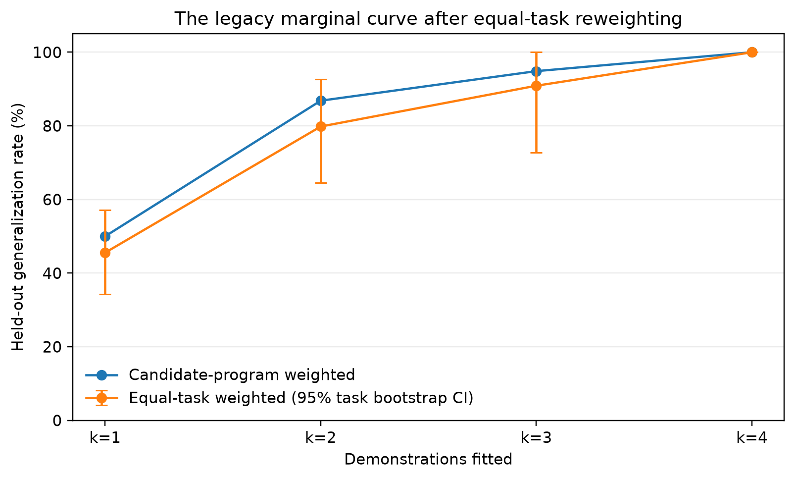
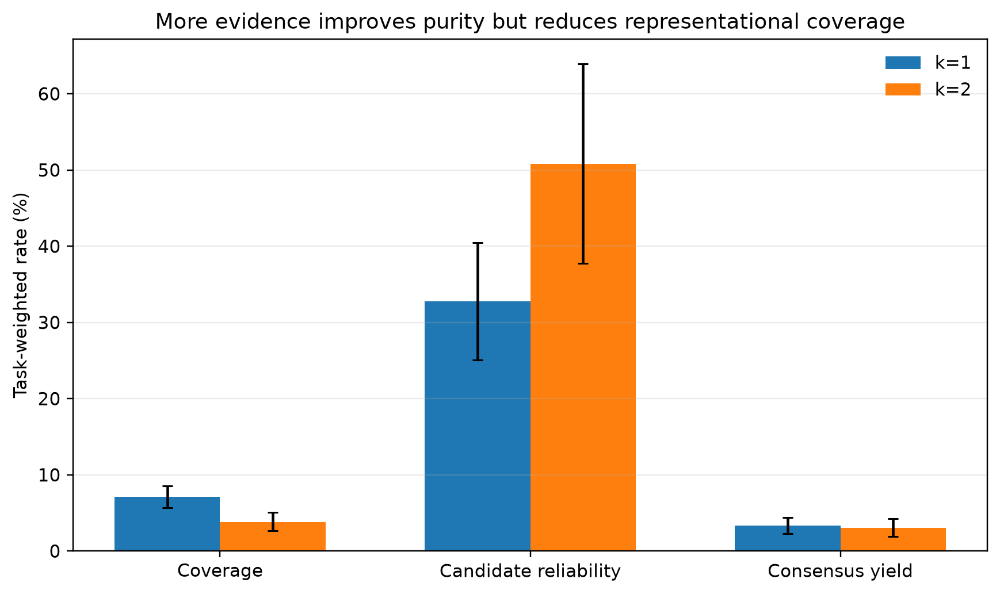
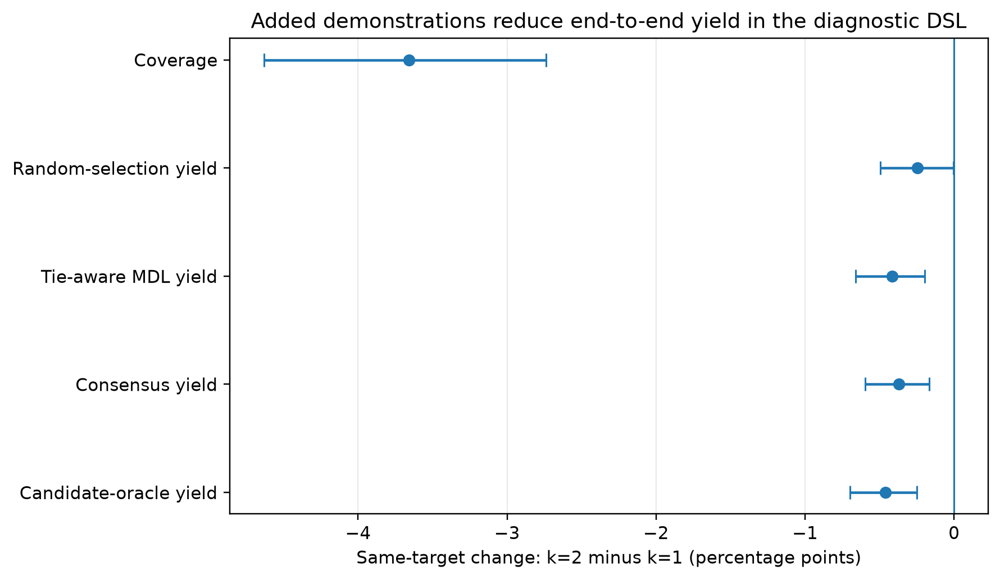
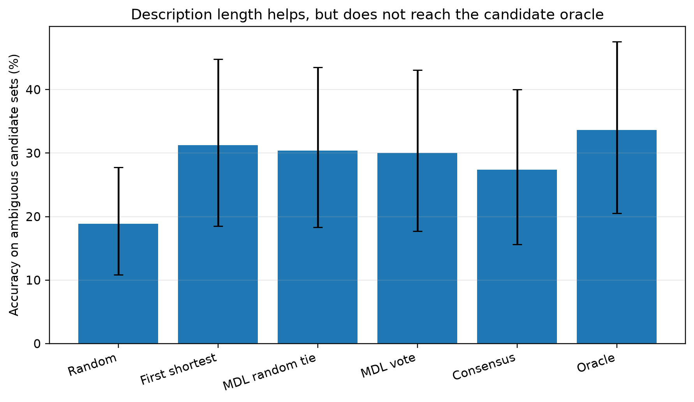
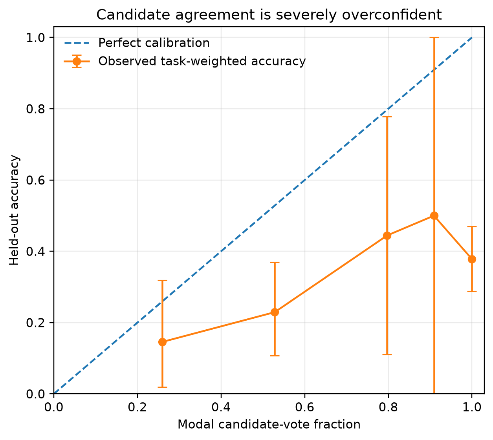

# How Do We Know an ARC Solution Is Right?
## Underdetermination, Calibration, and the N=120 Leaderboard Problem in ARC-AGI-2

**Robert Morong** · Independent research · ARC Prize 2026 Paper Track

---

## Abstract

Every ARC-AGI-2 solver ends the same way: it keeps the candidate transformations that reproduce the demonstration pairs, and — when several survive — picks one. We ask how much this final gate, and the leaderboard used to rank solvers, can actually tell us. Our headline results come from a **pre-registered same-holdout cross-fold design** that we adopted after it overturned our own first analysis — a case study, within the paper, of the rigor the paper argues for. First, calibration: conditional on our diagnostic solver producing a demonstration-consistent program, that program reproduces a **held-out** demonstration only **32.8%** of the time when fit on one other demonstration, **50.8%** on two, and **63.4%** on three (task-weighted, task-cluster 95% intervals). Evidence helps, but a "consistent" program is barely a third right at one demonstration and still only about two-thirds right at three — nowhere near the near-certainty solvers implicitly assume. An earlier prefix design suggested a far rosier 50%→87%→95% curve; that curve was an artifact of pooling candidate programs (over-weighting candidate-rich tasks) and of letting the held-out target change with the number of demonstrations. Second, selection: among consistent-but-disagreeing programs, choosing the shortest (minimum-description-length, Occam) program is a **real and statistically significant** lever, **+11.1 points over random selection (95% CI [+4.6, +17.9])** — but, contrary to our first analysis, it does **not** recover the candidate oracle (oracle − MDL = +3.7 points, 95% CI [+0.1, +9.5]). Third, we audit the leaderboard: at N=120 every score carries a **±≈9-point** 95% interval, the reported top-two gap (54% vs 45%) is **not significant (p=0.16)**, and resolving a 5-point frontier difference at 80% power would need ≈**1,566** tasks — thirteen times what exists. We release all code, data, pre-registrations, and a linked (honestly zero-scoring) submission. The contribution is not a new solver but a rigorous, self-audited account of *what the numbers can and cannot tell us*, plus reporting standards that would make ARC-AGI progress legible.

---

## 1. Introduction

The Abstraction and Reasoning Corpus (ARC-AGI) is designed so that each task is easy for humans and hard for machines, forcing systems to acquire a novel skill from a handful of demonstrations rather than retrieve a memorized one [1, 2]. ARC-AGI-2 hardens this: larger grids, multiple interacting rules, symbolic reinterpretation, and an efficiency budget. At the time of writing the verified frontier sits near **54%** while non-expert humans reach ~60% individually and 100% by panel.

Almost all attention goes to that headline number. This paper looks at the two measurement acts underneath it — *accepting* a candidate and *ranking* a system — and asks how much we can trust them.

The first act is **acceptance**: a solver keeps candidates consistent with the demonstration pairs. Whether the solver is a DSL search, a test-time-trained network, or an LLM proposing Python, the final gate is the same — *does this reproduce the demonstrations?* We show this gate is a miscalibrated proxy for the thing we care about (does it reproduce the held-out test?), and that the resulting choice among consistent-but-disagreeing programs — the **program-selection problem** — is a real, quantifiable lever, though a smaller one than a naive analysis suggests.

The second act is **ranking**: placing a system on a 120-task leaderboard and declaring one approach ahead of another. At N=120 the sampling noise is large enough that most adjacent comparisons are statistically indistinguishable, so much of what looks like progress is within the error bars.

**A note on method, up front.** Our first version of the acceptance analysis used a *prefix* design: fit demonstrations d₀…d_{k−1}, test d_k. It produced an attractive curve (≈50%→87%→95%) and a large selection lever (≈+24 points). Before trusting either, we pre-registered a stricter **same-holdout cross-fold** design (§3) that fixes the held-out target and reweights every task equally, then committed in writing to publish whatever it returned [HYPOTHESIS-crossfold-v2]. It returned smaller numbers. The calibration curve fell to 33%→51%→63% and the selection lever to ≈+11 points, and the claim that Occam selection "matches the oracle" was refuted by its own pre-registered kill condition. We report the corrected numbers throughout, and treat the correction itself as a result: it is a concrete demonstration of the measurement discipline this paper argues the field is missing.

Neither point requires beating the state of the art, a GPU cluster, or private data. Both are exercises in careful measurement, and both yield concrete, adoptable recommendations — the contribution the field currently lacks: not another point on the leaderboard, but an honest account of the ruler.

**Contributions.**
1. **A same-holdout calibration of the acceptance signal.** Conditional on producing a demonstration-consistent program, that program reproduces a held-out demonstration only 32.8% / 50.8% / 63.4% of the time at k = 1 / 2 / 3 (§4.1). Evidence raises reliability but never delivers the certainty solvers assume.
2. **A coverage–reliability trade-off.** In the same design, adding a demonstration *raises* candidate reliability but *lowers* representational coverage, so end-to-end yield does not improve (same-target k=2−k=1 change: −0.4 pp, 95% CI [−0.7, −0.2]) (§4.1). More evidence is not free.
3. **A selection lever, correctly sized.** Minimum-description-length (Occam) selection among ambiguous candidates beats random by +11.1 points (95% CI [+4.6, +17.9]) but does not reach the candidate oracle (§4.2) — a real, free improvement, honestly bounded.
4. **A statistical-significance audit of the leaderboard:** per-score confidence intervals, pairwise tests, and a power analysis showing 120 tasks cannot resolve frontier-scale differences (§4.3).
5. **A reproducible self-correction.** A pre-registered control that overturned the authors' own earlier, more flattering results — with all three analyses (prefix, task-weighted, same-holdout) released side by side (§3–§4), plus a reporting standard for ARC-AGI progress (§5) and an openly licensed code release with an honestly zero-scoring linked submission (§6).

---

## 2. Prior Work

**ARC solving.** Leading 2024–2025 approaches fall into a few families: DSL program synthesis / enumeration; test-time training that fine-tunes on a task's own demonstrations [4]; LLM-guided program search and refinement; and neural transduction that predicts grids directly. Induction and transduction solve *disjoint* task subsets and are complementary [3], and tiny or pretraining-free models can be surprisingly competitive [5, 6]. All of these ultimately accept candidates by demonstration-consistency and, when several survive, select among them — usually by heuristics (voting, first-found, majority) whose calibration is not reported. Our selection rule is orthogonal to and composable with every one of these: it operates on whatever candidate set the solver already produces.

**Calibration and selection.** Confidence calibration — whether stated confidence matches empirical accuracy, via reliability diagrams and expected calibration error [7] — is mature in classification but has, to our knowledge, not been applied to the *acceptance signal* of ARC solvers. The program-selection problem is the ARC instance of hypothesis underdetermination: with few observations many hypotheses fit, and a prior (here, description length / Occam) is needed to choose.

**Benchmark reliability.** The gap between overfittable public-evaluation scores and verified semi-private scores on ARC-AGI-2 is documented by the maintainers and by practitioners; as of mid-2026, third-party aggregators report ARC-AGI-2 "scores" as high as 77–92% while the verified frontier remains ~54%. The complementary point we make — that even the *verified* numbers carry large sampling uncertainty at N=120 — appears absent from the ARC discourse, which routinely quotes and ranks scores to the decimal.

---

## 3. Methodology

**Data.** We use the public ARC-AGI-2 corpus: 1,000 training and 120 evaluation tasks. We verified their structure directly: evaluation grids are markedly larger (median 18×19) than training grids (10×10); tasks use 10 colors, grids up to 30×30, a mean of 2.99 demonstration pairs (range 2–6), scored pass@2. Analyses that require ground-truth outputs use only the relationship between demonstrations and held-out pairs; we do **not** report a training-set solve score as a capability claim.

**Solver.** To study acceptance and selection concretely we implement a deterministic, CPU-only program-synthesis solver: a library of grid primitives (geometric symmetries, cropping, gravity, object/connected-component operations, fractal tiling, half-plane logical combinations) with bounded depth-2 and depth-3 compositions and parameterized operations whose parameters are *derived* from the demonstrations (color maps, tiling/scaling ratios). A program **passes** a demonstration set iff it reproduces every output exactly. The solver deliberately **over-generates** — the point is not to solve tasks but to expose the acceptance/selection dynamics with many consistent candidates per task. We exclude degenerate hypotheses (e.g. a constant "memorize-the-output" map that trivially fits any single demonstration) so the calibration measures genuine transformation rules. The solver's full-solve coverage is low by design (§6).

**Two flawed designs, and the one we trust.** Our acceptance analysis went through three versions; we report all three because their differences *are* the methodological finding.

*(a) Prefix, program-weighted (original).* For each task, fit d₀…d_{k−1} and test d_k, pooling over all candidate programs. This is the design behind the ≈50%→87%→95% curve. It has two defects: pooling programs lets a few candidate-rich tasks dominate the average, and increasing k simultaneously changes the held-out target and shrinks the set of tasks that still have a demonstration to hold out.

*(b) Prefix, task-weighted (diagnostic).* We recompute a rate within each (task, k) cell and average equally across tasks, with task-cluster bootstrap intervals. This removes the program-weighting bias but not the changing-target confound; we report it only to isolate how much each defect contributes.

*(c) Same-holdout cross-fold (primary, pre-registered).* For every task and every held-out demonstration h, we hold h fixed, enumerate every size-k subset of the *remaining* demonstrations, generate and retain the demonstration-consistent programs, and evaluate them on the same fixed target h. Every subset cell is recorded, including cells where no candidate survives. The task is the independent sampling unit; subsets and held-out targets are averaged within task before a 20,000-replicate task-cluster bootstrap (seed 20260727). This design, and its interpretation rules and kill conditions, were frozen before the run [HYPOTHESIS-crossfold-v2], with a written commitment to publish regardless of outcome. It is the source of every headline number in §4.1–§4.2.

**Primary quantities (same-holdout).** *Coverage*: probability the DSL produces any executable consistent candidate. *Candidate reliability*: correctness rate among generated consistent programs on the held-out target, conditional on coverage. *Consensus / MDL / random yield*: end-to-end probability (counting no-candidate cells as failures) that the respective selection rule returns the held-out output. *Oracle yield*: probability that at least one generated candidate is correct. The pre-registered primary contrast is k=2 minus k=1 on the same task and target.

**Selection rules.** Among the programs consistent with the available demonstrations we compare *random* (mean correctness over consistent programs), *consensus* (modal prediction), *tie-aware MDL* (minimum description length — composed-op count plus a parameter penalty, with equal-complexity ties resolved by vote), *legacy first-shortest* (enumeration-order shortest, retained only as a diagnostic, since list order must not masquerade as Occam), and the *any-correct oracle*. A (task, k) cell is **ambiguous** when the consistent programs produce ≥2 distinct predictions. Pre-registered kill condition: the claim that MDL "matches the oracle ceiling" is refuted by any reproducible ambiguous cell in which the oracle succeeds and MDL fails.

**Leaderboard statistics.** Treating a system's score as k successes in N=120 Bernoulli trials, we compute 95% Wilson intervals [8], unpaired two-proportion z-tests for adjacent pairs (deliberately conservative; the paired alternative is McNemar's test [9], §5), and a power analysis for the tasks needed to detect frontier-scale gaps at 80% power. Verified scores are from the ARC Prize 2025 technical report and public verified-leaderboard postings.

---

## 4. Results

### 4.1 "Consistent with the demonstrations" is a weak signal — and the first analysis oversold it

Under the pre-registered same-holdout design (1,000 tasks; 8,092 task/holdout/k folds; 28,476 demonstration-subset cells), the probability that a demonstration-consistent program reproduces the **fixed held-out** demonstration rises with evidence but stays far from certainty:

| Demonstrations fit (k) | Candidate reliability | 95% task-cluster CI | tasks |
|---|---|---|---|
| 1 | **32.8%** | [25.1, 40.4] | 1000 |
| 2 | **50.8%** | [37.8, 64.0] | 842 |
| 3 | **63.4%** | [39.5, 86.0] | 267 |

A consistent program is right about a **third** of the time at one demonstration and only about **two-thirds** at three — a solver treating "it fits the demonstrations" as near-certainty is badly overconfident across the entire range ARC-AGI-2 occupies (mean 2.99 demonstrations).

These numbers are markedly lower than our first analysis, and the difference is instructive (Figure 1). The original prefix, program-weighted curve read 50.0% → 86.8% → 94.9%. Reweighting tasks equally already pulls it down to 45.6% → 79.8% → 90.9% (candidate-rich tasks had been dominating the pool), and on the common tasks the prefix k=2−k=1 rise is not even significant (−4.6 pp, 95% CI [−17.6, +6.6]). Fixing the held-out target as well — the same-holdout design — lands at the table above. Two ordinary analysis choices, program-pooling and a moving target, had inflated a real-but-modest signal into an apparently decisive one.

*Figure 1: The original prefix curve, program-weighted vs. equal-task-weighted (95% task-cluster intervals). Program-pooling alone accounts for several points of the original curve's height; the residual rise is further confounded by the changing held-out target, which the same-holdout design (Table above) removes.*

**Adding evidence is not free.** In the same-holdout design, higher k raises candidate *reliability* but lowers *coverage* — the DSL produces a surviving candidate for fewer tasks when it must fit more demonstrations (coverage 7.1% → 3.8% → 4.4% at k = 1/2/3). The two effects cancel end-to-end: the pre-registered primary contrast, k=2 minus k=1 on the same target, is **−0.4 pp for MDL-vote yield (95% CI [−0.7, −0.2])**, with coverage falling −3.7 pp [−4.6, −2.7] (Figures 2–3). A demonstration buys purity at the cost of reach; whether that trade is worth making depends on a solver's generator, and it is invisible to any analysis that does not hold the target fixed.

*Figure 2: Same-holdout coverage, candidate reliability, and consensus yield at k=1 vs k=2 (task-weighted, 95% intervals). Reliability rises with evidence while coverage falls.*

*Figure 3: Pre-registered same-target change (k=2 minus k=1). Coverage drops significantly; end-to-end yields are flat-to-slightly-negative. Adding a demonstration does not improve this DSL's end-to-end behavior.*

### 4.2 The selection lever is real, and smaller than we first thought

Because acceptance is underdetermined, multiple programs routinely pass the same demonstrations while disagreeing on the held-out grid. Across **224 ambiguous cells in 41 tasks**, the selection rule matters, but bounded by the candidate oracle:

| Selection rule (on ambiguous cells) | Accuracy | 95% CI |
|---|---|---|
| Random consistent program | 18.9% | [10.8, 27.8] |
| Consensus vote | 27.4% | [15.6, 40.0] |
| **Tie-aware MDL (Occam)** | **30.0%** | [17.7, 43.1] |
| Legacy first-shortest (diagnostic) | 31.2% | [18.5, 44.8] |
| Oracle ceiling (any consistent program correct) | 33.7% | [20.5, 47.6] |

Tie-aware description-length selection beats random by **+11.1 points (95% CI [+4.6, +17.9])** — a real, statistically significant, zero-compute lever. But it does **not** recover the oracle: the gap **oracle − MDL = +3.7 points (95% CI [+0.1, +9.5])** excludes zero, so our first analysis's claim that Occam "recovers essentially all of the oracle ceiling" is refuted by its own pre-registered kill condition (Figure 4). Occam is a good default — the best principled rule we tested — but on these underdetermined cells it leaves a real, if small, margin on the table. (The enumeration-order *legacy* shortest edges MDL by a statistically indistinguishable 1.2 points; we do not treat arbitrary list order as a principled rule.)

*Figure 4: Accuracy on ambiguous cells by selection rule, with 95% task-cluster intervals (224 cells, 41 tasks). Description-length selection beats random significantly but stays below the candidate oracle.*

Agreement among consistent programs is a usable — if imperfect and overconfident — confidence signal: modal vote-fraction tracks accuracy monotonically, so a solver can rank which of its answers to trust and abstain or spend its second pass@2 attempt accordingly. But even high agreement falls short of the accuracy it implies (Figure 5), the same overconfidence documented in §4.1 reappearing at the selection stage.

*Figure 5: Reliability diagram for candidate agreement (modal vote-fraction vs. held-out accuracy, 95% intervals). The signal is monotone but sits well below the diagonal — usable for ranking, overconfident as a probability.*

**Why this still matters for frontier solvers.** Selection can only choose among the candidates a solver generates; it cannot conjure a correct one. Our simple symbolic library rarely contains a correct program for ARC-AGI-2's hardest tasks (hence a linked submission that honestly scores zero, §6). But over-generating solvers — LLM program synthesizers especially — routinely produce many candidates and select among them by first-found or majority vote. An ~11-point, statistically clean gap between random and Occam selection is accuracy those systems are plausibly leaving on the table, recoverable at no compute. Reporting *which* selection rule a solver uses, which most ARC papers omit, is thus a lever on the headline number, not a detail — even after the lever is sized honestly.

### 4.3 The ARC-AGI-2 leaderboard is mostly noise at N=120

Every ARC-AGI-2 score is 120 Bernoulli trials. The resulting 95% Wilson intervals are wide (Figure 6):

| System | Score | 95% CI |
|---|---|---|
| Poetiq (reported SOTA) | 54.0% | [45.1, 62.7] |
| Gemini 3 Pro (+refinement) | 54.0% | [45.1, 62.7] |
| Gemini 3 Deep Think | 45.0% | [36.4, 53.9] |
| Claude Opus 4.5 (Thinking) | 37.6% | [29.4, 46.5] |
| Kaggle 2025 winner (private) | 24.0% | [17.2, 32.4] |

The top three systems' intervals overlap heavily. A two-proportion test on the headline **54% vs 45%** gap yields **p = 0.16** — not significant; the "SOTA lead" is within noise. Adjacent comparisons are generally indistinguishable (45% vs 37.6%: p = 0.24), while only larger gaps clear significance (37.6% vs 24.0%: p = 0.02). A power analysis makes the ceiling explicit: detecting a **5-point** difference near the 50% frontier at 80% power would require **≈1,566** tasks; a 3-point difference ≈4,357; a 2-point difference ≈9,800. ARC-AGI-2 provides 120. Much of what is reported as month-to-month progress is, statistically, a redraw of the same distribution.

*Figure 6: Verified ARC-AGI-2 scores with 95% Wilson confidence intervals at N=120. The top three systems' intervals overlap heavily; the highlighted band marks the region shared by the top-two "SOTA" contenders, whose 9-point gap is not statistically significant (p=0.16).*

---

## 5. Discussion and a Reporting Standard

The findings share a root: **ARC-AGI progress is measured with small samples and reported without uncertainty — and the measurements are easy to oversell without noticing.** A handful of demonstrations underdetermines the program; 120 tasks underdetermine the ranking; and, as our own first analysis shows, ordinary weighting and hold-out choices can inflate a modest effect into a decisive-looking one. Neither the benchmark's few-shot difficulty nor its finite test set is a flaw — they are the point — but both demand statistical honesty the current discourse omits. We propose four standards, each cheap to adopt:

1. **Report confidence intervals** on every ARC-AGI score (Wilson or Clopper-Pearson at the stated N). A number without a ± is not interpretable at N=120.
2. **Test differences, don't eyeball them.** Claims that one system beats another should carry a paired test (McNemar) on per-task outcomes; absent per-task data, a two-proportion test at minimum.
3. **Report the selection rule** and, ideally, the acceptance-signal calibration. Any solver generating multiple consistent candidates is making a selection choice worth ~11 points; tie-aware description-length selection is a strong, free default, though not an oracle.
4. **State the weighting and the held-out unit, and pre-register them.** Our program-vs-task weighting and prefix-vs-same-holdout comparison changed the calibration curve by tens of points and the selection lever by half; per-example calibration claims should fix the sampling unit and, ideally, pre-register the design.
5. **Prefer cost-normalized, verified scores** and treat public-evaluation numbers as upper bounds, given the documented public-vs-verified gap.

**Limitations.** Our calibration and selection numbers reflect a simple symbolic solver's coverage; the ambiguous-cell count (224 cells, 41 tasks) yields wide CIs on the selection point estimates even where the ordering is unambiguous, and the high-k reliability cells (k≥3) are sparse. Richer over-generating solvers would both sharpen and raise the stakes of selection, and we expect underdetermination to be *worse* for them, not better. The one-shot public-evaluation replication of the same-holdout design confirmed the *direction* of the same-target effects but is near-floor in level, because the evaluation set is compositionally harder and our symbolic library covers very few of its tasks; we therefore lead with the training-corpus numbers and report the evaluation replication as a directional check only. Our leaderboard tests are unpaired and therefore conservative: paired testing on per-task results (which vendors do not publish) could resolve gaps we cannot — precisely why we call for that data.

---

## 6. Conclusion

ARC-AGI asks whether a system can acquire a new skill from few examples. Its two core measurements of that question — does a program fit the demonstrations, and where does a system rank — are both noisier than they are treated, and both easy to overstate. Under a pre-registered same-holdout control, demonstration-consistency is a roughly one-third signal at one example and only ~63% at three; program *selection* by description length is a real but bounded lever (~+11 points over random, short of the oracle); and the 120-task leaderboard cannot statistically resolve the differences it is used to rank. We know these numbers are modest partly because a stricter design cut down our own earlier, more flattering ones — which is the paper's point in miniature. The remedy is not more compute but more rigor: confidence intervals, significance tests, stated selection rules, declared weighting and hold-out units, and verified cost-normalized scores. Adopting them would let the field tell genuine progress from noise — the prerequisite for knowing when ARC-AGI has actually been solved.

---

## 7. Reproducibility

All code, data pointers, pre-registrations, and figure scripts are released under a public-domain-style license (MIT-0 for our own code; third-party dependencies noted). The solver (`dsl.py`), the same-holdout cross-fold experiment (`crossfold_analysis.py`, with `crossfold_replication.py` for the one-shot evaluation replication), the task-weighting diagnostic (`results/task_weighted_calibration.*`), the leaderboard statistics (`leaderboard_stats.py`), and the figure script (`fig_v2.py`, which reads only committed machine-readable results so figures cannot drift from the evidence record) reproduce every number in this paper from the public ARC-AGI-2 corpus on CPU in minutes. The pre-registration and its kill conditions are in `HYPOTHESIS-crossfold-v2.md`, frozen before the run.

A linked ARC-AGI-2 code submission packages the description-length-selecting solver; a mechanically validated Kaggle submission of the same frozen solver, covering the official 240-task / 259-output hidden schema, received a public score of **0.00**, confirming that the representation and selection gains observed on public training tasks did not transfer to the competition distribution. That zero is not a defect to hide but a datum consistent with the paper: a simple symbolic library rarely contains *any* correct program for these tasks, and selection can only choose among what the generator produces. The measurement, the same-holdout calibration, and the honestly-sized selection lever — not the solver — are the contribution.

*Data hazard, for future work: do not cite the 77–92% "frontier" figures circulating on third-party aggregators in 2026; those are public-evaluation or aggregation artifacts. The verified semi-private frontier is ~54%.*

---

## References

[1] F. Chollet. "On the Measure of Intelligence." arXiv:1911.01547, 2019.

[2] F. Chollet, M. Knoop, G. Kamradt, B. Landers, H. Pinkard. "ARC-AGI-2: A New Challenge for Frontier AI Reasoning Systems." arXiv:2505.11831, 2025.

[3] W.-D. Li, K. Hu, C. Larsen, et al. "Combining Induction and Transduction for Abstract Reasoning." arXiv:2411.02272, 2024. (ARC Prize 2024 Best Paper.)

[4] E. Akyürek, M. Damani, A. Zweiger, L. Qiu, H. Guo, J. Pari, Y. Kim, J. Andreas. "The Surprising Effectiveness of Test-Time Training for Abstract Reasoning." arXiv:2411.07279, 2024.

[5] A. Jolicoeur-Martineau. "Less is More: Recursive Reasoning with Tiny Networks." arXiv:2510.04871, 2025. (ARC Prize 2025 Paper Award.)

[6] I. Liao, A. Gu. "ARC-AGI Without Pretraining" (CompressARC). arXiv:2512.06104, 2025.

[7] C. Guo, G. Pleiss, Y. Sun, K. Q. Weinberger. "On Calibration of Modern Neural Networks." ICML (PMLR 70), pp. 1321–1330, 2017. arXiv:1706.04599.

[8] E. B. Wilson. "Probable Inference, the Law of Succession, and Statistical Inference." Journal of the American Statistical Association, 22(158):209–212, 1927.

[9] Q. McNemar. "Note on the Sampling Error of the Difference Between Correlated Proportions or Percentages." Psychometrika, 12(2):153–157, 1947.

*Verified scores in §4.3 are drawn from the ARC Prize 2025 Technical Report and public verified-leaderboard postings (Poetiq). Same-holdout numbers in §4.1–§4.2 are from `results/crossfold/training_audit/`; the pre-registration is `HYPOTHESIS-crossfold-v2.md`.*
